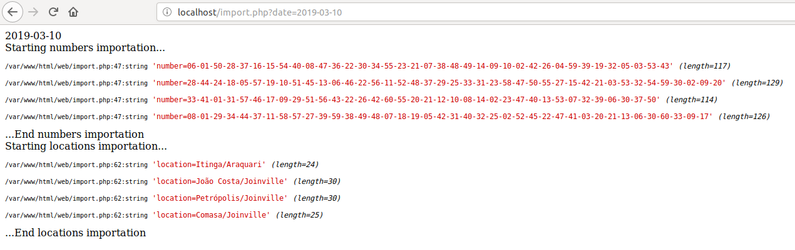

# Trimania Crawler

The Trimania is a organization that carry out sweepstakes in Santa Catarina state on Sundays and give prizes. 

I created this project to mount a dataset and to make studies in numbers and locations that it would answer questions like **What is the neighboorhood with more winners in Joinville?** or **What were the numbers most selected in last year?**.

## Start

Currently, this project runs only in localhost. To configure in your computer follow the steps below. 

a) Installing dependencies

```bash
$ composer install
```

b) Configure environment file

```bash
$ cp .env.default .env
```

c) You can use docker (I recommend)

```bash
$ docker-compose up -d
```

d) Import database

I like using the command line for that. Of course, you can to import the way you prefer. I let some databases in the *data directory*. 


```bash
mysql --host=172.17.0.1 -uroot -proot trimania < data/trimania_05_05_2018.sql
```

## Verify the containers

```bash
$ docker ps

CONTAINER ID        IMAGE
3efe06f79d2e        trimania-crawler_web    ...     
f1bbddbd9820        mysql                   ...
```

## Examples

To import or export data is necessary a __sweepstakes date__. Without this information will not possible run these functions. The date format is ```YYYY-MM-DD```.  

### Importing

To import data you need to access an URL like below.
```
http://localhost/import.php?date=2019-03-10
```
After the importation is showed the numbers and locations that were getting.



### Exporting

To export data, I created a service that makes the task. I build my filter and I inform the filename on PHP to make the download of CSV file.

```php
$data = $queryBuilder
	->table('numbers')
	->columns(['draw_date', 'numbers_drawn'])
	->where(['YEAR(draw_date) = 2018'])
	->select();

$export = new ExportData($data, 'trimaniaNumbers', ';');

$export->download(); 
```